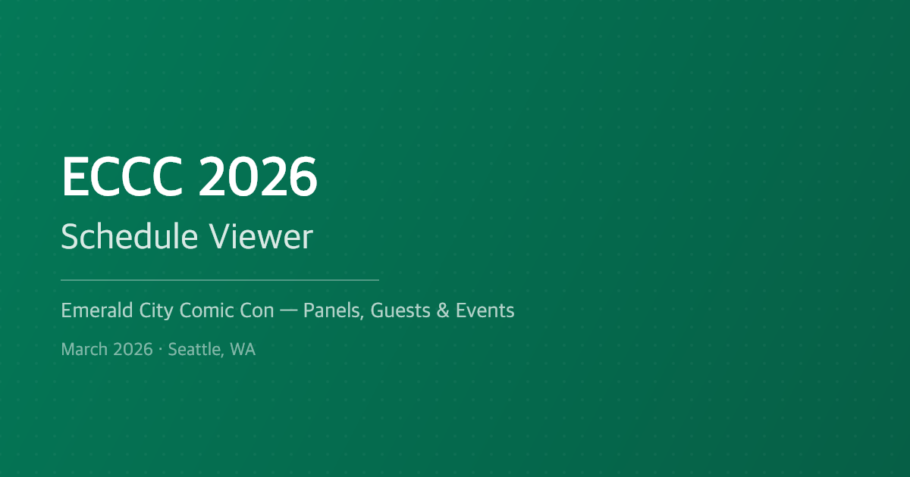

# ECCC '26 Schedule

A fast, modern schedule viewer for [Emerald City Comic Con 2026](https://www.emeraldcitycomiccon.com/) — browse 370+ panels, autographings, meetups, and workshops across all four days.

**[eccc26.karilaa.dev](https://eccc26.karilaa.dev/)**



## Features

- **Day tabs** — switch between Thursday through Sunday or view all days at once
- **Search** — find events by name with real-time debounced search
- **Filters** — narrow by category, tags, and location; combine freely
- **Favorites** — star events to build your personal schedule, persisted in localStorage
- **Dark mode** — automatic system detection with manual toggle
- **Offline support** — cached schedule works without network; polls for updates when online
- **PWA** — installable on mobile as a standalone app
- **Deep links** — share direct links to individual events via URL hash

## Tech Stack

- **[Bun](https://bun.sh)** — server, bundler, and runtime
- **[React 19](https://react.dev)** — UI with hooks, no external state library
- **[Tailwind CSS 4](https://tailwindcss.com)** — styling via `bun-plugin-tailwind`
- **LeapEvent API** — proxied through the Bun server with 30-min cache

## Quick Start

```bash
bun install
bun --hot server.tsx
```

Open [localhost:3000](http://localhost:3000).

## Docker

### Run with Docker

```bash
docker run -p 3000:3000 ghcr.io/karilaa-dev/emerald-schedule:latest
```

### Build locally

```bash
docker build -t emerald-schedule .
docker run -p 3000:3000 emerald-schedule
```

### Docker Compose

```bash
docker compose up -d
```

Open [localhost:3000](http://localhost:3000).

## Project Structure

```
server.tsx              Bun.serve() entry — API proxy, caching, rate limiting
public/index.html       HTML shell with fonts and meta tags
src/
  App.tsx               Main component — layout, filters, timeline
  types.ts              API data interfaces
  styles.css            Tailwind theme tokens, animations
  lib/                  Pure utilities (api, dates, filters, colors, html)
  hooks/                React hooks (schedule, favorites, filters, theme, online)
  components/           UI components (Timeline, EventCard, FilterPanel, etc.)
```
