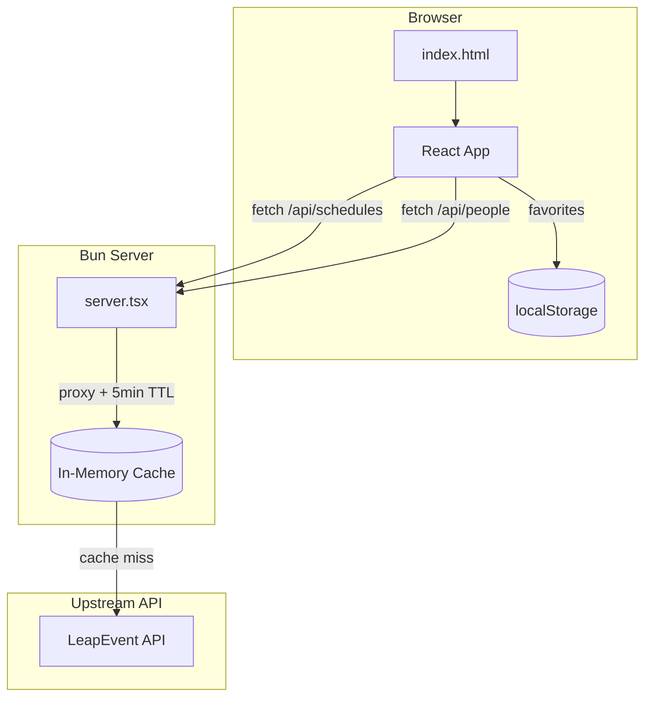
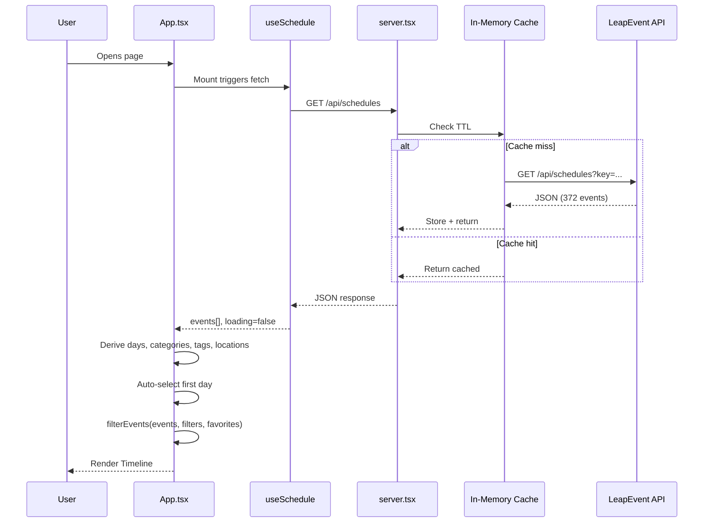
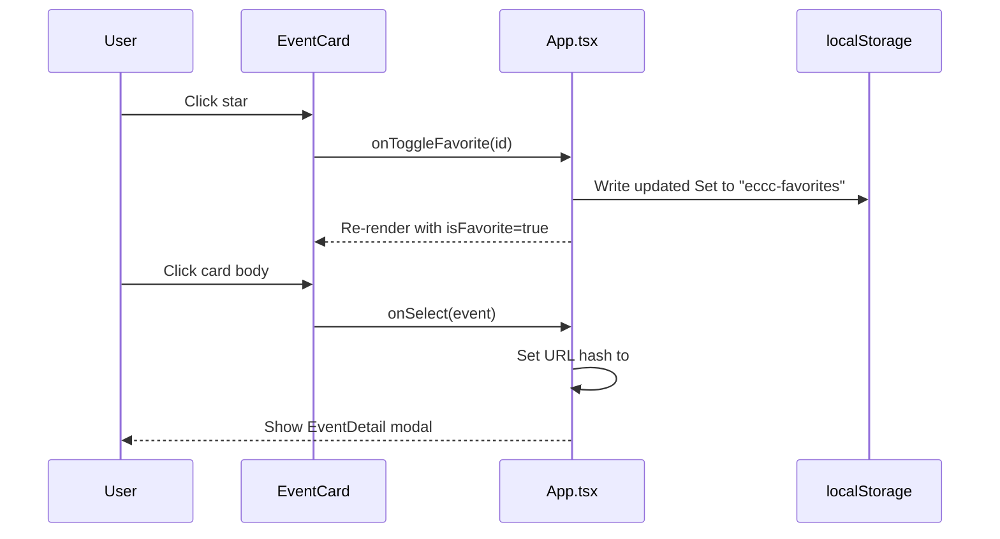

# Codebase Map

> Auto-generated by Cartographer. Last mapped: 2026-02-23

## System Overview



## Directory Structure

```
emerald-schedule/
  server.tsx                 # Bun.serve() entry — API proxy + HTML serving
  bunfig.toml                # Tailwind plugin config for Bun
  tsconfig.json              # TypeScript config (DOM libs enabled)
  package.json               # Dependencies: react, react-dom, tailwindcss, bun-plugin-tailwind
  public/
    index.html               # HTML shell — Google Fonts, React mount point
  src/
    index.tsx                # React createRoot entry
    App.tsx                  # Main orchestration — hooks, filters, layout, modal
    styles.css               # Tailwind v4 @theme tokens, animations, noise texture
    types.ts                 # TypeScript interfaces for API data shapes
    lib/
      api.ts                 # Fetch wrappers for /api/schedules, /api/people
      dates.ts               # Time parsing, formatting, grouping (Pacific Time)
      filters.ts             # Pure filter pipeline + unique value extraction
      colors.ts              # Category-to-color mapping with hash fallback
      html.ts                # HTML entity decoder (textarea trick)
    hooks/
      useSchedule.ts         # Fetch schedule data on mount with loading/error
      useFavorites.ts        # localStorage-backed Set<number> with toggle
      useFilters.ts          # FilterState management with toggle/clear callbacks
    components/
      Header.tsx             # App title bar
      DayTabs.tsx            # Thu/Fri/Sat/Sun day selector pills
      SearchBar.tsx           # Debounced text input (300ms)
      FilterPanel.tsx         # Collapsible category/tag/location filter chips
      Timeline.tsx            # Maps hour groups to TimeSlot components
      TimeSlot.tsx            # Sticky hour label + responsive event card grid
      EventCard.tsx           # Compact card with staggered entrance animation
      EventDetail.tsx         # Full-info modal with backdrop blur + scroll lock
      FavoritesBar.tsx        # Floating bottom pill for favorites toggle
      EmptyState.tsx          # No-results message with clear-filters action
  .claude/
    launch.json              # Dev server config for Claude Preview
```

## Module Guide

### Server (`server.tsx`)

**Purpose**: Bun HTTP server that serves the frontend and proxies upstream API calls.
**Entry point**: `server.tsx`

| File | Purpose | Tokens |
|------|---------|--------|
| server.tsx | Bun.serve with routes, API proxy, in-memory cache | ~400 |

**Exports**: None (side-effect: starts server on port 3000)
**Dependencies**: `./public/index.html` (HTML import)
**Key behavior**:
- Routes: `/` serves HTML, `/api/schedules` and `/api/people` proxy to LeapEvent
- Cache: `Map<string, CacheEntry>` with 5-minute TTL per endpoint
- API key (`c21df843-40f8-490a-b09c-ea3399be72cf`) stays server-side

### Types (`src/types.ts`)

**Purpose**: TypeScript interfaces matching the LeapEvent API response shapes.

| File | Purpose | Tokens |
|------|---------|--------|
| types.ts | All shared TS interfaces | ~400 |

**Exports**: `ScheduleEvent`, `Person`, `Category`, `ScheduleTag`, `VenueLocation`, `EventImage`, `EventPerson`, `FilterState`, `ScheduleApiResponse`, `PeopleApiResponse`
**Dependents**: Used by nearly every file in `src/`

### Library Utilities (`src/lib/`)

**Purpose**: Pure utility functions with no React dependency.

| File | Purpose | Tokens |
|------|---------|--------|
| api.ts | Fetch wrappers for `/api/schedules`, `/api/people` | ~150 |
| dates.ts | Parse, format, group times (Pacific, no TZ conversion) | ~700 |
| filters.ts | Sequential filter pipeline, unique value extractors | ~500 |
| colors.ts | Category-to-color map, djb2 hash fallback for unknowns | ~500 |
| html.ts | HTML entity decoding via textarea DOM trick | ~50 |

**Key patterns**:
- `dates.ts`: Manual time parsing (`parseTime`) avoids timezone issues; times displayed as-is with "PT" suffix
- `filters.ts`: `filterEvents()` applies guards in order: day, categories, tags, locations, search, favoritesOnly — all AND-combined with early returns
- `colors.ts`: 16 hardcoded category colors + `hashColor()` fallback using djb2 hash to HSL

### React Hooks (`src/hooks/`)

**Purpose**: Stateful logic separated from UI components.

| File | Purpose | Tokens |
|------|---------|--------|
| useSchedule.ts | Fetches schedule on mount, manages loading/error state | ~200 |
| useFavorites.ts | localStorage-backed `Set<number>`, toggle function | ~200 |
| useFilters.ts | FilterState with toggle/set/clear callbacks | ~400 |

**Key patterns**:
- `useSchedule`: Cancelled-fetch pattern (boolean flag in cleanup)
- `useFavorites`: Reads from `localStorage("eccc-favorites")` on init, writes on every toggle
- `useFilters`: `clearFilters()` preserves the current `day` selection; `hasActiveFilters` ignores day

### UI Components (`src/components/`)

**Purpose**: React presentational and container components.

| File | Purpose | Tokens |
|------|---------|--------|
| Header.tsx | App title bar | ~100 |
| DayTabs.tsx | Day selector pills derived from data | ~200 |
| SearchBar.tsx | Debounced search input (300ms) | ~200 |
| FilterPanel.tsx | Collapsible filter panel with FilterSection sub-component | ~500 |
| Timeline.tsx | Groups events by hour, renders TimeSlot list | ~150 |
| TimeSlot.tsx | Sticky hour label + responsive grid (1/2/3 cols) | ~200 |
| EventCard.tsx | Compact card with staggered animation, hover-reveal star | ~400 |
| EventDetail.tsx | Modal with full event info, Escape key, scroll lock | ~700 |
| FavoritesBar.tsx | Fixed-position floating pill for favorites toggle | ~150 |
| EmptyState.tsx | No-results with conditional clear-filters button | ~150 |

**Key patterns**:
- `EventCard`: CSS animation delay = `min(index * 30, 300)ms` for stagger effect
- `EventDetail`: `useEffect` adds keydown listener + `document.body.style.overflow = "hidden"`
- `FilterPanel`: Internal `FilterSection` shows 6 items, expands with "+N more" button
- `TimeSlot`: Sticky header at `top-24` (below the main header)

### App Orchestration (`src/App.tsx`)

**Purpose**: Main component that wires hooks, derives data, and renders the full layout.

| File | Purpose | Tokens |
|------|---------|--------|
| App.tsx | Root component — all state, filtering, layout | ~1200 |

**Dependencies**: All hooks, all components, `lib/filters.ts`, `lib/dates.ts`
**Key behavior**:
- Derives unique days/categories/tags/locations via `useMemo`
- Auto-selects first available day on data load
- Applies `filterEvents()` pipeline via `useMemo` (memoized on filter + data changes)
- URL hash deep-linking: reads `#event-{id}` on mount, writes on modal open
- Renders: Header > DayTabs > SearchBar > FilterPanel > Timeline/EmptyState > FavoritesBar > EventDetail modal

### Styling (`src/styles.css`)

**Purpose**: Tailwind v4 theme tokens and custom animations.

| File | Purpose | Tokens |
|------|---------|--------|
| styles.css | @theme block, animations, noise texture, scrollbar | ~500 |

**Key tokens**: `--font-display` (Bricolage Grotesque), `--font-body` (DM Sans), warm surface palette (`--color-surface-*`), emerald accent (`--color-accent`), gold favorite color
**Animations**: `animate-card-in` (slide-up 0.35s), `animate-backdrop` (fade-in), `animate-modal` (slide-up + fade), skeleton shimmer

## Data Flow





## Conventions

- **Bun-first**: No Node/Express/Vite. HTML imports, `Bun.serve()`, `bun-plugin-tailwind`
- **No routing library**: Single-page app with URL hash for deep-linking
- **No state library**: React hooks only (`useState`, `useEffect`, `useMemo`, `useCallback`)
- **Pure utilities in `lib/`**: No React imports, easily testable
- **Hooks in `hooks/`**: Each hook owns one domain (schedule, favorites, filters)
- **Components are presentational**: Props-driven, no direct data fetching
- **Tailwind v4 `@theme`**: Custom design tokens in CSS, not `tailwind.config`
- **Times as-is**: API times are Pacific, displayed verbatim with "PT" suffix
- **Font stack**: Bricolage Grotesque (display/headings) + DM Sans (body)

## Gotchas

1. **No timezone handling**: `parseTime()` manually splits the `"YYYY-MM-DD HH:MM:SS"` string to avoid JS Date timezone shifting. Never use `new Date(apiTimeString)` directly.
2. **`dangerouslySetInnerHTML`**: `EventDetail.tsx` renders event descriptions as raw HTML from the API. The API HTML is trusted but could theoretically contain XSS if the upstream source is compromised.
3. **HTML entities in titles**: The API returns HTML-encoded strings (e.g., `D&amp;D`). Must use `decodeEntities()` from `html.ts` when displaying titles outside of `dangerouslySetInnerHTML`.
4. **`fetchPeople` unused**: `lib/api.ts` exports `fetchPeople()` but no component calls it yet. People data (speakers) comes embedded in the schedule response.
5. **Category colors hardcoded**: The API returns empty color fields, so `colors.ts` has a manual map. New categories will fall through to the djb2 hash-based fallback.
6. **Favorites key**: Stored under `"eccc-favorites"` in localStorage as a JSON array of numbers.
7. **Cache is in-memory**: Server restart clears the API cache. The 5-minute TTL means stale data is possible during event updates.
8. **No error retry**: `useSchedule` fetches once on mount; network failures show a static error state with no retry button.

## Navigation Guide

**To add a new API endpoint**:
1. Add proxy route in `server.tsx` (follow the `fetchCached` pattern)
2. Add fetch wrapper in `src/lib/api.ts`
3. Add response types in `src/types.ts`

**To add a new filter dimension**:
1. Add field to `FilterState` in `src/types.ts`
2. Add toggle/state logic in `src/hooks/useFilters.ts`
3. Add filter guard in `filterEvents()` in `src/lib/filters.ts`
4. Add extractor function (e.g., `getUniqueFoo()`) in `src/lib/filters.ts`
5. Add UI section in `src/components/FilterPanel.tsx`
6. Wire props through `src/App.tsx`

**To add a new component**:
1. Create `src/components/NewComponent.tsx`
2. Import and render in `src/App.tsx`

**To change the visual theme**:
1. Edit `@theme` tokens in `src/styles.css`
2. Update Google Fonts link in `public/index.html` if changing font families

**To add speaker/people detail**:
1. Call `fetchPeople()` from `src/lib/api.ts` (already implemented)
2. Create a `usePeople` hook or extend `useSchedule`
3. Cross-reference via `person.schedules[].id` matching `event.id`
4. Create a `PersonDetail` component for speaker bios
