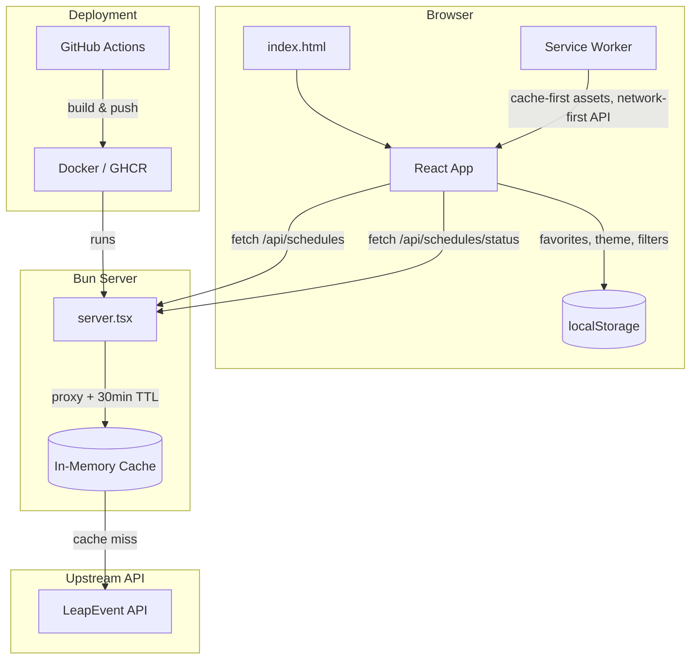
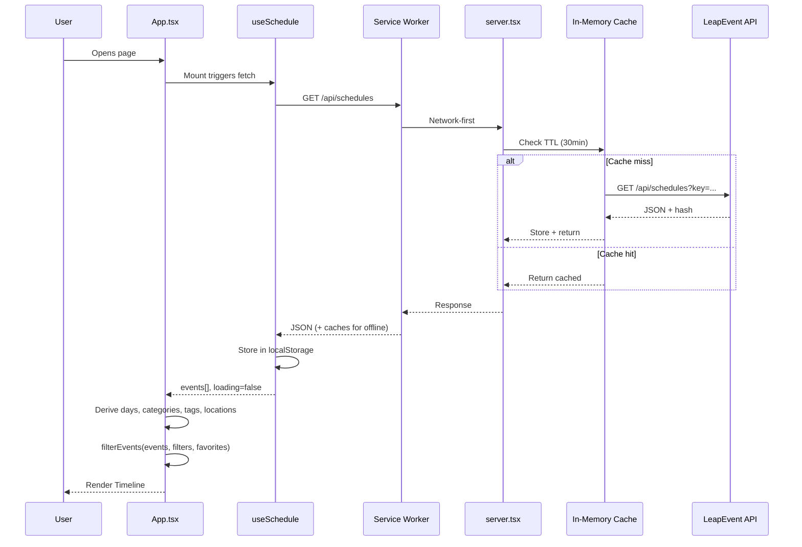
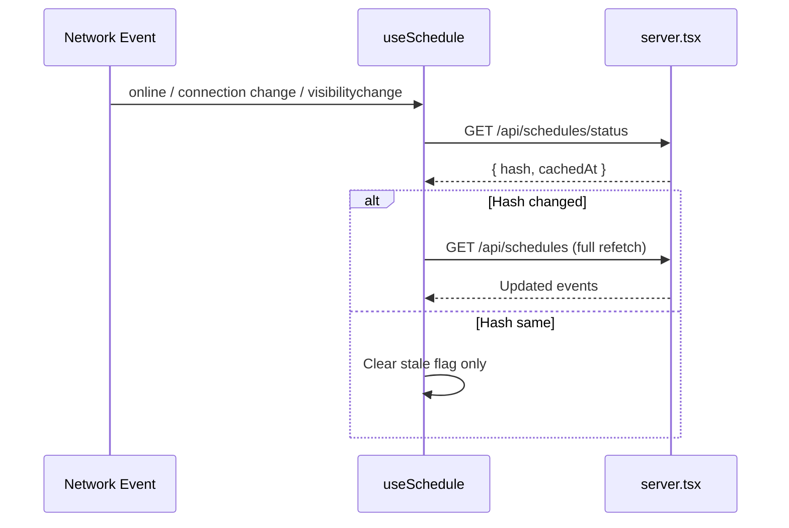

# Codebase Map

> Auto-generated by Cartographer. Last mapped: 2026-02-24

## System Overview



## Directory Structure

```
emerald-schedule/
  server.tsx                 # Bun.serve() entry — API proxy, rate limiting, static assets
  bunfig.toml                # Tailwind plugin config for Bun
  tsconfig.json              # TypeScript config (DOM libs enabled)
  package.json               # Dependencies: react 19, react-dom, tailwindcss 4, bun-plugin-tailwind
  Dockerfile                 # Two-stage Alpine build for Bun server
  docker-compose.yml         # Production compose pulling GHCR image
  .github/
    workflows/
      docker.yml             # CI/CD — build & push Docker image on push/release
  public/
    index.html               # HTML shell — PWA meta, dark mode FOUC prevention, fonts
    sw.js                    # Service worker — offline caching strategies
    manifest.json            # PWA web app manifest
    og-image.png             # Open Graph social sharing image
    icons/                   # PWA icons (192, 512, maskable SVGs)
  src/
    index.tsx                # React createRoot entry + SW registration
    App.tsx                  # Main orchestration — all hooks, filters, layout
    styles.css               # Tailwind v4 @theme tokens, animations, noise texture
    types.ts                 # TypeScript interfaces for API data shapes
    lib/
      api.ts                 # Fetch wrappers + OfflineError sentinel class
      dates.ts               # Time parsing, formatting, grouping (Pacific Time)
      filters.ts             # Pure filter pipeline + unique value extraction
      colors.ts              # Category-to-color mapping with hash fallback
      html.ts                # HTML entity decoder + URL linkifier
    hooks/
      useSchedule.ts         # Data fetching, caching, polling, hash-based updates, reconnect
      useFavorites.ts        # localStorage-backed Set<number> with toggle
      useFilters.ts          # FilterState management with toggle/clear callbacks
      useOnlineStatus.ts     # Network status detection (online/offline/connection/visibility)
      useTheme.ts            # Dark/light theme with system preference + localStorage
      useInstallPrompt.ts    # PWA install prompt capture and management
    components/
      DayTabs.tsx            # Thu/Fri/Sat/Sun day selector pills
      SearchBar.tsx          # Debounced text input (300ms)
      FilterPanel.tsx        # Collapsible category/tag/location/favorites filter chips
      Timeline.tsx           # Groups events by hour/day, renders TimeSlot list
      TimeSlot.tsx           # Sticky hour label + responsive event card grid
      EventCard.tsx          # Compact card with staggered animation + star button
      EventDetail.tsx        # Full-info modal with backdrop blur + scroll lock
      FavoritesBar.tsx       # Floating bottom pill for favorites toggle
      EmptyState.tsx         # No-results message with clear-filters action
      OfflineBanner.tsx      # Amber banner when offline or data is stale
      InstallTip.tsx         # PWA install prompt banner
      ScheduleFooter.tsx     # Last-checked/updated timestamps, tap/long-press refresh
      ThemeToggle.tsx        # Sun/moon icon toggle button
  .claude/
    launch.json              # Dev server config for Claude Preview
```

## Module Guide

### Server (`server.tsx`)

**Purpose**: Bun HTTP server — proxies LeapEvent API with in-memory cache and rate limiting, serves all static assets.
**Entry point**: `server.tsx`

| File | Purpose | Tokens |
|------|---------|--------|
| server.tsx | Bun.serve with routes, API proxy, cache, rate limiting | ~500 |

**Exports**: None (side-effect: starts server on port 3000)
**Dependencies**: `./public/index.html` (HTML import)
**Key behavior**:
- Routes: `/` HTML, `/api/schedules` + `/api/schedules/status` + `/api/people` (proxied), `/sw.js`, `/manifest.json`, `/robots.txt`, `/og-image.png`, `/icons/*`
- Cache: `Map<string, CacheEntry>` with 30-minute TTL; entries store `{ data, hash, timestamp }`
- Hash: `Bun.hash()` on raw API data — enables `/api/schedules/status` endpoint for efficient polling
- Rate limiting: 4 requests per 60s per IP (via `x-forwarded-for`)
- API key stays server-side

### Deployment (`Dockerfile`, `docker-compose.yml`, `.github/workflows/docker.yml`)

**Purpose**: Docker build and CI/CD pipeline.

| File | Purpose | Tokens |
|------|---------|--------|
| Dockerfile | Two-stage Alpine build for Bun | ~80 |
| docker-compose.yml | Production compose pulling GHCR image | ~50 |
| .github/workflows/docker.yml | Build & push to GHCR on push/release | ~200 |

### Types (`src/types.ts`)

**Purpose**: TypeScript interfaces matching the LeapEvent API response shapes.

| File | Purpose | Tokens |
|------|---------|--------|
| types.ts | All shared TS interfaces | ~200 |

**Exports**: `ScheduleEvent`, `Category`, `ScheduleTag`, `VenueLocation`, `EventImage`, `EventPerson`, `FilterState`, `ScheduleApiResponse`
**Dependents**: Used by nearly every file in `src/`

### Library Utilities (`src/lib/`)

**Purpose**: Pure utility functions with no React dependency.

| File | Purpose | Tokens |
|------|---------|--------|
| api.ts | Fetch wrappers + `OfflineError` class + `X-SW-Cache` detection | ~100 |
| dates.ts | Parse, format, group times (Pacific, no TZ conversion) | ~400 |
| filters.ts | Sequential filter pipeline, unique value extractors | ~200 |
| colors.ts | Category-to-color map, djb2 hash fallback for unknowns | ~150 |
| html.ts | `decodeEntities()` + `linkifyHtml()` | ~80 |

**Key patterns**:
- `api.ts`: `OfflineError extends Error` — thrown when SW serves cached response (detected via `X-SW-Cache: 1` header)
- `dates.ts`: Manual time parsing (`parseTime`) avoids timezone issues; times displayed as-is with "PT" suffix
- `filters.ts`: `filterEvents()` applies guards in order: day, categories, tags, locations, search, favoritesOnly — all AND-combined with early returns
- `colors.ts`: 16 hardcoded category colors + `hashColor()` fallback using djb2 hash to HSL
- `html.ts`: `linkifyHtml()` wraps bare URLs in `<a>` tags and ensures `target="_blank" rel="noopener noreferrer"`

### React Hooks (`src/hooks/`)

**Purpose**: Stateful logic separated from UI components.

| File | Purpose | Tokens |
|------|---------|--------|
| useSchedule.ts | Fetch, cache, poll, hash-based updates, reconnect triggers | ~600 |
| useFavorites.ts | localStorage-backed `Set<number>`, toggle function | ~100 |
| useFilters.ts | FilterState with toggle/set/clear callbacks | ~250 |
| useOnlineStatus.ts | Reactive network status via multiple event sources | ~100 |
| useTheme.ts | Dark/light theme, system preference, localStorage | ~130 |
| useInstallPrompt.ts | PWA `beforeinstallprompt` capture and management | ~150 |

**Key patterns**:
- `useSchedule`: Hash-based polling every 15 min; two rate limiters (checks: 4/15s, fetches: 4/60s); reconnect via `online`, `navigator.connection.change`, `visibilitychange`; falls back to `localStorage("eccc-schedule-cache")` on failure
- `useFavorites`: Reads from `localStorage("eccc-favorites")` on init, writes on every toggle
- `useFilters`: `clearFilters()` preserves the current `day` selection; `hasActiveFilters` ignores day; `initialState` reads localStorage at module level
- `useOnlineStatus`: Listens to `online`/`offline`, `navigator.connection` change (Android), and `visibilitychange` (foreground re-check)
- `useTheme`: First visit reads `prefers-color-scheme`; applies `class="dark"` to `<html>` + updates `meta[theme-color]`
- `useInstallPrompt`: Captures `beforeinstallprompt`, dismiss persisted to localStorage

### UI Components (`src/components/`)

**Purpose**: React presentational components, all props-driven.

| File | Purpose | Tokens |
|------|---------|--------|
| DayTabs.tsx | Day selector pills (responsive labels) | ~120 |
| SearchBar.tsx | Debounced search input with clear button | ~150 |
| FilterPanel.tsx | Collapsible filter panel with chips + favorites toggle | ~500 |
| Timeline.tsx | Groups events by hour/day, renders TimeSlot list | ~200 |
| TimeSlot.tsx | Sticky hour label + responsive grid (1/2/3 cols) | ~120 |
| EventCard.tsx | Compact card with staggered animation + star button | ~300 |
| EventDetail.tsx | Full-info modal, bottom sheet on mobile, centered on desktop | ~600 |
| FavoritesBar.tsx | Fixed floating pill for favorites toggle | ~100 |
| EmptyState.tsx | No-results with conditional clear-filters button | ~80 |
| OfflineBanner.tsx | Amber banner when offline/stale | ~40 |
| InstallTip.tsx | PWA install prompt banner | ~80 |
| ScheduleFooter.tsx | Timestamps + tap-to-check / long-press force-update | ~250 |
| ThemeToggle.tsx | Sun/moon icon button with cross-fade transition | ~100 |

**Key patterns**:
- `EventCard`: CSS animation delay = `min(index * 30, 300)ms`; keyboard accessible
- `EventDetail`: Escape key closes; `overflow: hidden` on body; `linkifyHtml()` for descriptions
- `FilterPanel`: Internal `FilterSection` shows 6 items, expands with "+N more" button
- `ScheduleFooter`: Adaptive tick rate (1s when recent, 60s otherwise); long press (500ms) = force update, short tap = hash check
- `TimeSlot`: Sticky header at `top-24` (below the main header)

### App Orchestration (`src/App.tsx`)

**Purpose**: Root component — wires all hooks, derives filtered data, renders full page layout.

| File | Purpose | Tokens |
|------|---------|--------|
| App.tsx | All state, filtering, deep-linking, layout | ~1000 |

**Dependencies**: All hooks, all components, `lib/filters.ts`, `lib/dates.ts`
**Key behavior**:
- Derives unique days/categories/tags/locations via `useMemo`
- Day auto-selection: first visit picks `days[0]`, explicit "all" is respected, stale stored day resets
- Deep-linking: reads `#event-{id}` on mount, writes on modal open
- Layout: sticky header (title + ThemeToggle + DayTabs) > InstallTip > OfflineBanner > FilterPanel + Timeline > ScheduleFooter > FavoritesBar (fixed) > EventDetail (modal)

### Styling (`src/styles.css`)

**Purpose**: Tailwind v4 theme tokens and custom animations.

| File | Purpose | Tokens |
|------|---------|--------|
| styles.css | @theme block, animations, noise texture, scrollbar | ~350 |

**Key tokens**: `--font-display` (Outfit), `--font-body` (Figtree), warm surface palette, emerald accent, gold favorite
**Dark mode**: Variables are in inline `<style>` in `index.html` (not here) to survive Tailwind tree-shaking
**Animations**: `card-in` (slide-up 0.35s), `shimmer` (skeleton), `fade-in` (backdrop), `slide-up` (modal)

### PWA (`public/sw.js`, `public/manifest.json`)

**Purpose**: Offline support and installability.

| File | Purpose | Tokens |
|------|---------|--------|
| sw.js | Service worker — caching strategies | ~250 |
| manifest.json | PWA metadata and icons | ~80 |

**Key behavior**:
- SW cache name: `eccc-v1`; auto-cleans old versions on activate
- `/api/*` → network-first (with SW cache fallback + `X-SW-Cache: 1` header)
- Static assets → cache-first
- Navigation → network-first
- Google Fonts → cache-first

## Data Flow





## Conventions

- **Bun-first**: No Node/Express/Vite. HTML imports, `Bun.serve()`, `bun-plugin-tailwind`
- **No routing library**: Single-page app with URL hash for deep-linking
- **No state library**: React hooks only (`useState`, `useEffect`, `useMemo`, `useCallback`)
- **Pure utilities in `lib/`**: No React imports, easily testable
- **Hooks in `hooks/`**: Each hook owns one domain (schedule, favorites, filters, theme, online, install)
- **Components are presentational**: Props-driven, no direct data fetching
- **Tailwind v4 `@theme`**: Custom design tokens in CSS, not `tailwind.config`
- **Times as-is**: API times are Pacific, displayed verbatim with "PT" suffix
- **Font stack**: Outfit (display/headings) + Figtree (body)
- **Dark mode tokens in HTML**: Inline `<style>` in `index.html`, not in `styles.css` (survives tree-shaking)

## Gotchas

1. **No timezone handling**: `parseTime()` manually splits the `"YYYY-MM-DD HH:MM:SS"` string to avoid JS Date timezone shifting. Never use `new Date(apiTimeString)` directly.
2. **HTML injection in EventDetail**: Event descriptions rendered as raw HTML via `innerHTML` (ref-based). API HTML is trusted but carries XSS risk if upstream is compromised.
3. **HTML entities in titles**: The API returns HTML-encoded strings (e.g., `D&amp;D`). Must use `decodeEntities()` from `html.ts` when displaying titles.
4. **Category colors hardcoded**: The API returns empty color fields, so `colors.ts` has a manual map. New categories fall through to djb2 hash-based fallback.
5. **Cache is in-memory**: Server restart clears the API cache. 30-minute TTL means stale data is possible during event updates.
6. **Dark mode variables NOT in styles.css**: They live in inline `<style>` in `index.html`. Tailwind's CSS bundler tree-shakes `.dark {}` rules it doesn't see used.
7. **`X-SW-Cache` header is the offline signal**: `api.ts` throws `OfflineError` when present. Without it, SW-cached responses would look like live data.
8. **`useInstallPrompt` only works in Chromium**: `beforeinstallprompt` is not supported on Safari/Firefox. The tip simply never appears.
9. **`initialState` in useFilters reads localStorage at module level**: Outside React lifecycle, runs once when module is first imported.
10. **`fetchPeople` removed**: People data comes embedded in schedule events (`event.people`).

## Navigation Guide

**To add a new API endpoint**:
1. Add proxy route in `server.tsx` (follow the `fetchCached` pattern)
2. Add fetch wrapper in `src/lib/api.ts`
3. Add response types in `src/types.ts`

**To add a new filter dimension**:
1. Add field to `FilterState` in `src/types.ts`
2. Add toggle/state logic in `src/hooks/useFilters.ts`
3. Add filter guard in `filterEvents()` in `src/lib/filters.ts`
4. Add extractor function (e.g., `getUniqueFoo()`) in `src/lib/filters.ts`
5. Add UI section in `src/components/FilterPanel.tsx`
6. Wire props through `src/App.tsx`

**To add a new component**:
1. Create `src/components/NewComponent.tsx`
2. Import and render in `src/App.tsx`

**To change the visual theme**:
1. Edit `@theme` tokens in `src/styles.css`
2. Edit dark mode overrides in inline `<style>` in `public/index.html`
3. Update Google Fonts link in `public/index.html` if changing font families

**To modify offline behavior**:
1. Caching strategies in `public/sw.js`
2. Offline detection in `src/hooks/useOnlineStatus.ts`
3. Stale/reconnect handling in `src/hooks/useSchedule.ts`
4. Banner UI in `src/components/OfflineBanner.tsx`

**To modify the polling/update system**:
1. Rate limits and poll interval in `src/hooks/useSchedule.ts`
2. Hash endpoint in `server.tsx` (`/api/schedules/status`)
3. Footer UI in `src/components/ScheduleFooter.tsx`
